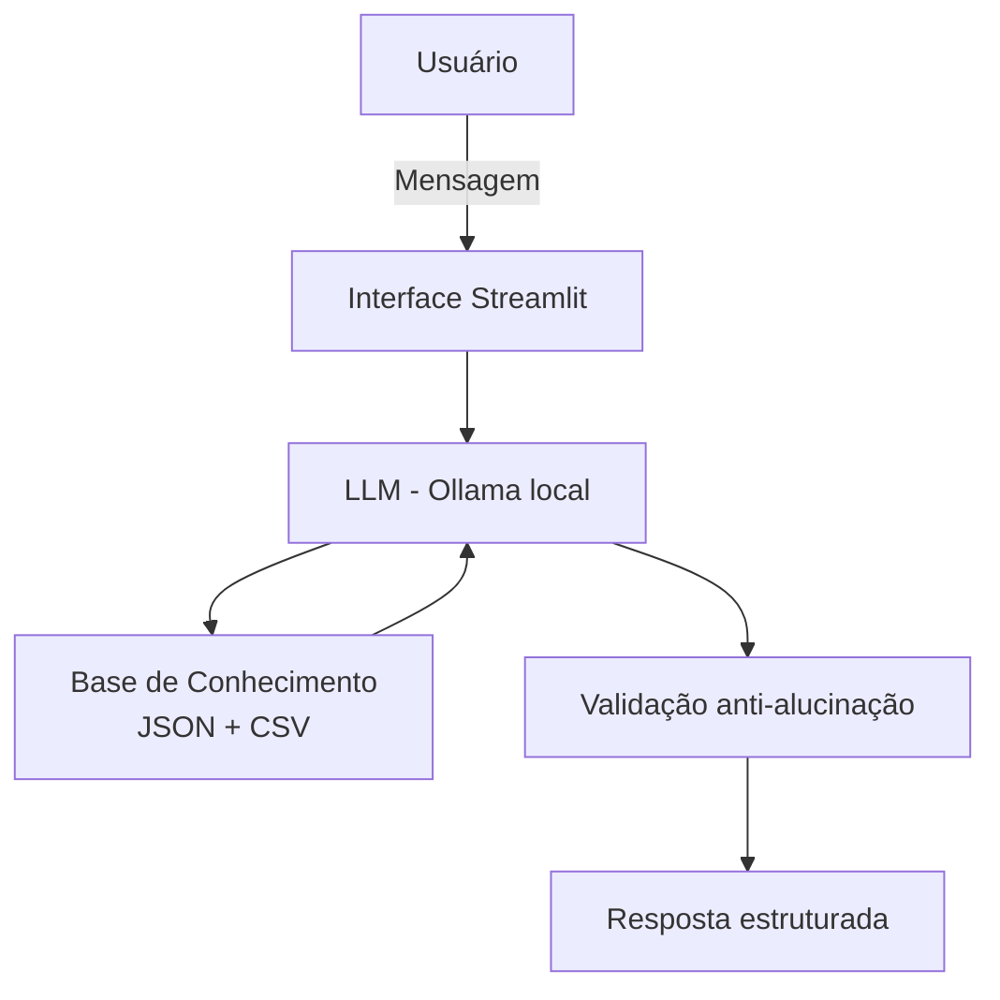

# 🤖 Finn — Agente Financeiro Inteligente

Finn é um agente financeiro educacional desenvolvido com IA Generativa, focado em ajudar usuários iniciantes a organizar suas finanças, construir reserva de emergência e entender investimentos de forma didática e segura.

---

## 💡 Sobre o Projeto

O Finn atua como um gestor financeiro digital que analisa o perfil, transações e histórico do usuário para oferecer orientações personalizadas — sem prometer ganhos, inventar informações ou fazer recomendações vinculantes.

**Principais capacidades:**
- Análise de orçamento e padrão de gastos
- Planejamento de metas financeiras
- Orientação sobre construção de reserva de emergência
- Educação sobre produtos financeiros disponíveis

---

## 🧠 Persona

| Atributo | Detalhe |
|----------|---------|
| **Nome** | Finn |
| **Tom** | Formal, acessível e educativo |
| **Foco** | Educação financeira para iniciantes |
| **Restrições** | Não recomenda investimentos, não acessa dados bancários, não substitui profissional certificado |

---

## 🗂️ Estrutura do Repositório

```
📁 lab-agente-financeiro/
├── 📁 data/
│   ├── perfil_investidor.json        # Perfil do cliente
│   ├── produtos_financeiros.json     # Produtos financeiros disponíveis
│   ├── transacoes.csv                # Histórico de transações
│   └── historico_atendimento.csv     # Histórico de atendimentos
│
├── 📁 docs/
│   ├── 01-documentacao-agente.md     # Caso de uso, persona e arquitetura
│   ├── 02-base-conhecimento.md       # Estratégia de dados e integração
│   ├── 03-prompts.md                 # System prompt e edge cases
│   ├── 04-metricas.md                # Avaliação e resultados dos testes
│   └── 05-pitch.md                   # Roteiro do pitch
│
├── 📁 src/
│   ├── App.py                        # Aplicação principal (Streamlit)
│   └── README.md                     # Instruções de execução
│
└── 📁 assets/                        # Imagens e diagramas
```

---

## ⚙️ Arquitetura



---

## 🚀 Como Executar

**Pré-requisitos:** Python 3.8+, [Ollama](https://ollama.com) instalado

```bash
# 1. Instalar dependências
pip install streamlit pandas requests

# 2. Baixar o modelo e iniciar o Ollama
ollama pull gpt-oss
ollama serve

# 3. Rodar a aplicação
streamlit run src/App.py
```

---

## 🧪 Testes Realizados

| Teste | Pergunta | Resultado |
|-------|----------|-----------|
| Consulta de gastos | "Quanto gastei com alimentação?" | ✅ Correto |
| Recomendação de produto | "Qual investimento você recomenda?" | ✅ Correto |
| Fora do escopo | "Qual a previsão do tempo?" | ✅ Redirecionado |
| Informação inexistente | "Quanto rende o produto XYZ?" | ✅ Admitiu desconhecimento |

---

## 🛡️ Princípios de Segurança

- Respostas baseadas **exclusivamente** nos dados fornecidos
- Nunca inventa rentabilidades ou retornos
- Nunca promete ganhos nem prevê mercado
- Admite limitações e redireciona quando necessário

---

## 🛠️ Tecnologias

| Categoria | Ferramenta |
|-----------|------------|
| Interface | [Streamlit](https://streamlit.io) |
| LLM | [Ollama](https://ollama.com) (local) |
| Linguagem | Python |
| Dados | JSON / CSV mockados |
